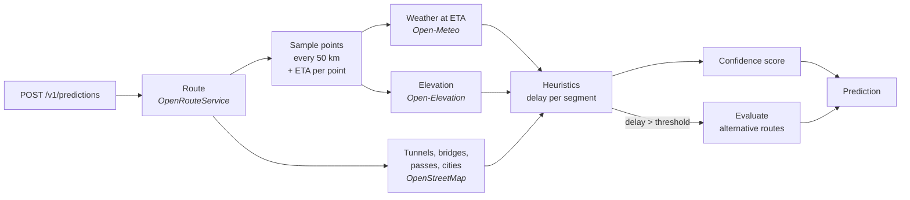

<h1 align="center">Logintel API</h1>

<p align="center">
  <strong>Weather-aware delay prediction for road freight.</strong><br>
  Give it a route and a departure time — get back the minutes the weather will cost you, segment by segment, with a confidence score and alternative routes.
</p>

<p align="center">
  <a href="https://www.python.org/"></a>
  <a href="https://fastapi.tiangolo.com/"></a>
  <a href="https://docs.astral.sh/ruff/"></a>
  <a href="LICENSE"></a>
</p>

<p align="center">
  <a href="#quick-start">Quick start</a> ·
  <a href="#how-a-prediction-is-built">How it works</a> ·
  <a href="#the-heuristics">Heuristics</a> ·
  <a href="#api">API</a> ·
  <a href="#configuration">Configuration</a> ·
  <a href="#deployment">Deployment</a>
</p>

---

```console
$ curl -X POST localhost:8000/v1/predictions -H "Content-Type: application/json" -d '{
    "origin":         {"lat": 45.4642, "lon": 9.1900},
    "destination":    {"lat": 41.9028, "lon": 12.4964},
    "departure_time": "2026-09-18T08:00:00+02:00",
    "include_alternatives": true
  }'
```

```jsonc
{
  "total_delay_minutes": 28.5,
  "confidence": { "overall": 82.3, "level": "good", "components": { "time_horizon": 95.0, "weather_stability": 72.0, "historical_accuracy": 70.0, "data_completeness": 100.0 } },
  "segments": [
    { "index": 0, "length_km": 50.0, "estimated_arrival": "2026-09-18T08:40:00+02:00",
      "weather": [ { "type": "rain", "severity": "moderate", "raw_value": 4.5, "description": "Moderate rain, aquaplaning possible" } ],
      "factors": { "road_type": "highway", "road_factor": 0.8, "altitude_m": 120.0, "altitude_factor": 1.0, "time_factor": 1.4, "calibration_factor": 1.0, "special_elements": [] },
      "delay_minutes": 4.48 },
    // … one entry per 50 km
  ],
  "alternatives": [
    { "route_index": 1, "total_delay_minutes": 12.0, "distance_km": 560.2, "duration_minutes": 340.0, "delay_savings_minutes": 16.5,
      "summary": "Alternative 1: 560.2 km, 340 min base travel, saves 16 min delay" }
  ]
}
```

## Why

Freight planners know how long a route takes in good weather. What they lack is a
number for *how much longer it will take tomorrow at 8:00, with that front coming in over
the Apennines*. Logintel API answers that question with **transparent heuristics** rather
than a black box: every minute of predicted delay is traceable to a weather condition, a
road type, an altitude band, a time of day and a calibration coefficient — and every
prediction says how much it trusts itself.

- **Per-segment breakdown** — the route is sampled every 50 km; each segment gets its own forecast, factors and delay.
- **Confidence score** — time horizon, forecast stability, historical accuracy and data completeness, combined into a 0–100 score.
- **Alternative routes** — when the delay is significant, up to two alternatives are evaluated with the same pipeline and compared.
- **Self-calibrating** — customers report the delay they actually experienced; coefficients are re-estimated as feedback accumulates.
- **Zero-cost data stack** — routing, weather, elevation and road infrastructure all come from free, open APIs, cached aggressively.
- **Production plumbing** — API keys and JWT auth, per-organization rate limiting, circuit breakers, structured JSON logs, metrics and alerting, health endpoint.

## Quick start

Requirements: Python 3.11+ and a free [OpenRouteService](https://openrouteservice.org/dev/#/signup) API key. Everything else is optional.

```bash
git clone <this repository> logintel-api && cd logintel-api
python -m venv venv && source venv/bin/activate      # Windows: venv\Scripts\activate
pip install -r requirements-dev.txt
cp .env.example .env                                 # add your ORS_API_KEY
uvicorn app.main:app --reload
```

Open <http://localhost:8000/docs> for the interactive Swagger UI. Without Supabase and
Redis configured the API runs in **development mode**: no authentication, in-memory
storage, no cache — enough to try every endpoint. Working client code for Python,
JavaScript, PHP and cURL lives in [`docs/examples/`](docs/examples/).

## How a prediction is built



1. **Route** — OpenRouteService computes the heavy-goods-vehicle route (and, on request, up to two alternatives in the same call). The polyline, duration and road-type ranges are cached for 24 h, keyed on origin/destination snapped to a ~500 m grid so nearby requests share a cache entry.
2. **Sampling** — points are placed every 50 km along the polyline and given an estimated arrival time proportional to the route duration.
3. **Enrichment** — three requests run concurrently: the hourly forecast for every point *at its arrival hour* (one batched Open-Meteo call), the elevation of every point (one batched Open-Elevation call) and the infrastructure within a 5 km corridor of the route (one Overpass query).
4. **Heuristics** — each segment's weather conditions are turned into minutes of delay using the tables below.
5. **Confidence** — four components are weighted into a single score.
6. **Alternatives** — only when requested *and* the main-route delay exceeds `ALTERNATIVE_DELAY_THRESHOLD_MINUTES` (15 by default), the alternative routes go through the same sampling → enrichment → heuristics pipeline and are ranked by the minutes they save.

Every upstream call has retries with exponential backoff and a per-service circuit
breaker. When a non-critical source fails the pipeline degrades instead of aborting:
elevation falls back to 200 m, missing weather counts as clear sky *and* lowers the
data-completeness score, and OpenStreetMap data is simply skipped.

## The heuristics

For every weather condition active on a segment:

```
delay_per_100km = base_impact(type, severity) × F_road × F_altitude × F_time × C_calibration × M_elements
segment_delay   = Σ delay_per_100km × segment_km / 100
```

### Base impact — minutes per 100 km

| Condition | Light | Moderate | Heavy | Very heavy |
|---|---|---|---|---|
| **Rain** (mm/h) | ≥ 0.1 → **3** | ≥ 2.5 → **8** | ≥ 7.5 → **15** | ≥ 15 → **25** |
| **Snow** (cm/h) | ≥ 0.1 → **10** | ≥ 1 → **25** | ≥ 3 → **45** | ≥ 5 → **70** |
| **Wind** (km/h) | — | ≥ 40 → **6** | ≥ 60 → **12** | ≥ 80 → **30** |
| **Fog** (visibility) | ≤ 500 m → **8** | < 200 m → **18** | < 50 m → **40** | — |

### Context multipliers

| Road type | F_road | | Altitude | F_altitude | | Time of travel | F_time |
|---|---|---|---|---|---|---|---|
| Highway | 0.8 | | 0–300 m | 1.0 | | Night (22–06) | 0.7 |
| State road | 1.0 | | 300–600 m | 1.1 | | Rush hour (7–9, 17–19) | 1.4 |
| Provincial | 1.3 | | 600–1000 m | 1.3 | | Weekend | 0.85 |
| Mountain | 1.8 | | 1000–1500 m | 1.6 | | Summer exodus (Jul–Aug, Fri–Sun) | 1.5 |
| | | | > 1500 m | 2.0 | | Otherwise | 1.0 |

Road types come from the OpenRouteService way-type extras; altitude from Open-Elevation;
the time factor is evaluated at the segment's estimated arrival time.

### Special route elements (OpenStreetMap)

| Element | Effect |
|---|---|
| Tunnel (> 500 m) | Shields the covered share of the segment: weather delay × (1 − tunnel km / segment km) |
| Bridge / viaduct | Wind and snow delay × 1.3 |
| Mountain pass | Snow delay × 1.9 |
| Urban centre (city/town) | Time factor × 1.3 |

### Confidence score

```
confidence = 0.40 × horizon + 0.30 × stability + 0.20 × historical + 0.10 × completeness
```

| Component | How it is scored |
|---|---|
| Time horizon | < 6 h → 95 · < 24 h → 80 · < 48 h → 65 · otherwise 50 |
| Weather stability | 95 minus the variance of the raw weather readings across segments, floored at 40 |
| Historical accuracy | Share of recent feedback within 15 min of the prediction (70 until 5 entries exist) |
| Data completeness | Share of sample points that had forecast data |

`high` ≥ 85 · `good` ≥ 70 · `moderate` ≥ 55 · `low` below.

### Calibration loop

Customers `POST` the delay they actually observed. Once at least **20 feedback entries
spanning 14 days and 3 distinct weather conditions** exist, every coefficient is nudged
toward the observed error ratio and a new, versioned coefficient set is stored:

```
error_factor = mean(actual_delay / predicted_delay)  per dominant (type, severity)
new_coeff    = clamp(old + 0.15 × (error_factor − 1) × old,  0.5, 2.0)
```

Calibration is global — every organization's feedback improves the model for everyone —
and conservative by design: a 15 % learning rate and hard bounds prevent a burst of noisy
feedback from swinging predictions.

## API

| Method | Path | Description |
|---|---|---|
| `POST` | `/v1/predictions` | Create a prediction |
| `GET` | `/v1/predictions/{id}` | Retrieve a prediction |
| `GET` | `/v1/predictions` | List predictions (paginated, newest first) |
| `POST` | `/v1/predictions/{id}/feedback` | Report the observed delay |
| `GET` | `/v1/analytics/accuracy` | MAE, within-10/20-min rates, breakdown by weather |
| `GET` | `/v1/health` | Dependency status, metrics and active alerts (public) |

Authentication is by **API key** (`X-API-Key`, stored as a SHA-256 hash) or **Supabase
JWT** (`Authorization: Bearer`). Every prediction belongs to an organization; `POST`
requests are rate-limited per organization in a sliding one-hour window. All errors share
one shape — `{"error": {"code", "message", "details"}}` — and every response carries an
`X-Request-ID`.

Request/response formats, validation rules and error codes are documented in
[`docs/API.md`](docs/API.md); common questions in [`docs/FAQ.md`](docs/FAQ.md).

## Architecture

```
app/
├── main.py                 FastAPI app, lifespan, middleware wiring
├── config.py               Settings from environment variables
├── auth.py                 API key / JWT → organization context
├── rate_limit.py           Sliding-window limiter per organization
├── errors.py               Exception types and uniform JSON error responses
├── middleware.py           X-Request-ID propagation, request timing
├── logging_config.py       JSON logs with request/organization correlation
├── metrics.py              Latency percentiles, error rate, cache hit rate
├── alerting.py             Threshold alerts with cooldowns
├── circuit_breaker.py      Per-service CLOSED → OPEN → HALF_OPEN breaker
├── models/schemas.py       Pydantic request/response models
├── engine/                 Pure functions — no I/O
│   ├── heuristics.py       Weather classification, multipliers, segment delay
│   ├── special_elements.py Tunnel / bridge / pass / urban modifiers
│   ├── sampler.py          Haversine sampling and ETA estimation
│   ├── confidence.py       Confidence score
│   └── calibration.py      Error factors and coefficient updates
├── services/               Async clients for external systems
│   ├── ors.py              OpenRouteService routing (+ alternatives)
│   ├── weather.py          Open-Meteo batched hourly forecasts
│   ├── elevation.py        Open-Elevation batched lookup
│   ├── overpass.py         OpenStreetMap corridor query
│   ├── cache.py            Redis (Upstash) JSON cache
│   ├── http_client.py      Shared httpx client, retry, circuit breaking
│   ├── supabase.py         PostgREST client
│   └── prediction.py       Pipeline orchestration
├── routes/                 HTTP endpoints
└── stores/                 Persistence: in-memory or Supabase (Protocol-typed)
supabase/migrations/        Database schema (predictions, feedback, calibration, orgs, keys)
tests/                      pytest suite with mocked upstream services
```

**Data sources and caching**

| Source | Used for | Cache |
|---|---|---|
| [OpenRouteService](https://openrouteservice.org/) | Routing, road types, alternatives | 24 h, ~500 m coordinate grid |
| [Open-Meteo](https://open-meteo.com/) | Hourly forecasts | 1 h, per 0.1° cell and hour |
| [Open-Elevation](https://open-elevation.com/) | Altitude | — (batched, one call per prediction) |
| [Overpass / OpenStreetMap](https://wiki.openstreetmap.org/wiki/Overpass_API) | Tunnels, bridges, passes, cities | 7 days + in-process fallback |

OpenRouteService's free tier (2,000 requests/day) is the binding constraint; route
caching, coordinate snapping and computing alternatives only above the delay threshold
keep well within it.

**Observability** — every log line is JSON with `request_id` and `organization_id`.
`/v1/health` exposes uptime, p95 latency, error rate over the last two minutes, cache
hit rate, the state of every circuit breaker and the alerts currently firing
(error rate > 10 %, breaker open > 5 min, p95 > 3 s, cache hit rate < 30 %).

## Configuration

All settings are environment variables (or a local `.env`, see [`.env.example`](.env.example)).

| Variable | Default | Description |
|---|---|---|
| `ORS_API_KEY` | — | OpenRouteService key (**required** for real predictions) |
| `SUPABASE_URL` / `SUPABASE_SERVICE_KEY` | — | Enables persistence and authentication; leave unset for in-memory dev mode |
| `SUPABASE_JWT_SECRET` | — | Verifies `Bearer` tokens (Project Settings → API → JWT Secret) |
| `UPSTASH_REDIS_URL` | — | Redis cache; unset disables caching |
| `APP_ENV` | `development` | `production` refuses to start without Supabase credentials |
| `LOG_LEVEL` | `INFO` | Root log level |
| `SAMPLING_INTERVAL_KM` | `50` | Distance between sample points |
| `MAX_FORECAST_HOURS` | `72` | How far ahead departures may be |
| `ALTERNATIVE_DELAY_THRESHOLD_MINUTES` | `15` | Main-route delay above which alternatives are evaluated |
| `ENABLE_SPECIAL_ELEMENTS` | `true` | Query OpenStreetMap for tunnels, bridges, passes and cities |
| `CACHE_TTL_ROUTE` / `CACHE_TTL_WEATHER` / `CACHE_TTL_OSM` | `86400` / `3600` / `604800` | Cache TTLs in seconds |
| `CB_FAILURE_THRESHOLD` / `CB_RECOVERY_TIMEOUT` | `5` / `30` | Circuit breaker: failures before opening, seconds before probing |
| `ALERT_ERROR_RATE_PCT` / `ALERT_LATENCY_P95_MS` / `ALERT_CACHE_RATE_PCT` / `ALERT_CB_OPEN_SECONDS` | `10` / `3000` / `30` / `300` | Alert thresholds |

## Deployment

The service is a single stateless process; it runs anywhere that runs Python. The repo
ships a `Procfile` and `runtime.txt` for [Railway](https://railway.app/)-style platforms.

1. **Database** — create a Supabase project and run the files in
   [`supabase/migrations/`](supabase/migrations/) in order from the SQL editor.
2. **Organization and API key** — generate a key locally and store only its hash:

   ```bash
   python -c "import hashlib, secrets; k = secrets.token_urlsafe(32); print('key:', k); print('hash:', hashlib.sha256(k.encode()).hexdigest())"
   ```

   ```sql
   INSERT INTO organizations (id, name, tier, rate_limit_hour) VALUES ('acme', 'Acme Logistics', 'starter', 200);
   INSERT INTO api_keys (key_hash, organization_id) VALUES ('<hash>', 'acme');
   ```

3. **Cache** — create an Upstash Redis database and copy its `rediss://` URL.
4. **Environment** — set the variables above with `APP_ENV=production`, then deploy.
   The start command is `uvicorn app.main:app --host 0.0.0.0 --port $PORT`.

Users signing in through Supabase Auth can call the API with their access token as long
as `app_metadata.org_id` names their organization.

## Development

```bash
pytest                       # test suite (upstream services are mocked with respx/fakeredis)
ruff check app tests         # lint
ruff format app tests        # format
```

The engine (`app/engine/`) is pure and synchronous — every heuristic is a small function
with a table next to it, which is where most tuning happens. External integrations live in
`app/services/` and are the only place that performs I/O. Stores are swapped at startup
depending on configuration, so the whole API runs — and is tested — without any external
service.

### Known limitations

- No live traffic data: the delay is weather-only, on top of the routing engine's travel time.
- Rate limiting, metrics and circuit breakers are in-process; run a single instance or put a shared limiter in front.
- Heuristic tables were tuned for European roads and heavy goods vehicles.
- Overpass and Open-Elevation are community services with fair-use limits; both degrade gracefully when unavailable.

## License

Released under the [MIT License](LICENSE).
